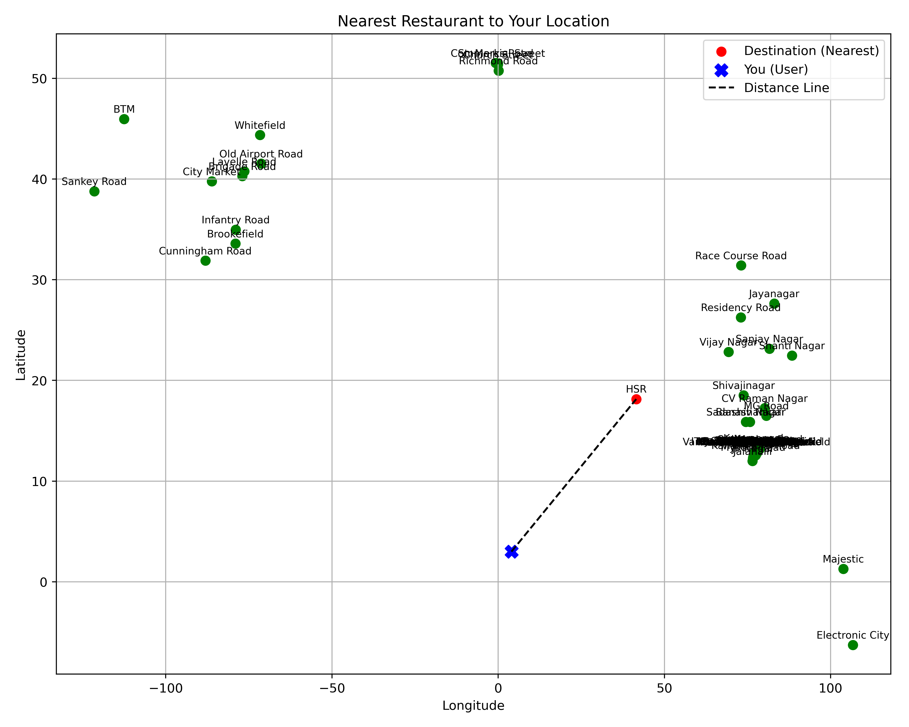

### Nearest Neighbor Search using K-d Tree

Allows querying the closest point (e.g., restaurant or location) to a given latitude and longitude from a CSV dataset. The python client uses subprocess to run the `nearest_neighbor` executable with the given latitude and longitude as arguments. The output is a JSON object with the name, latitude, and longitude of the nearest point. The python client also plots the nearest point on a map using matplotlib and saves the plot as a PNG file in the `output` directory.

All data points are from the Zomato restaurant dataset downloaded from kaggle.


KDNode *insert(KDNode *root, Point *point, int axis);

// Build entire kd-tree (balanced) from array of points
KDNode *build_kd_tree(Point *points, int start, int end, int axis);

KDNode *build_kd_tree_sequential(Point *points, int n);

int search_point(KDNode *root, Point *target);

void rangeSearch(KDNode *root, Point *min, Point *max, int axis);

// Nearest neighbor search
void nearest_neighbor(KDNode *root, Point *target, KDNode **best, double *best_dist);

void insert_neighbor(Neighbor neighbors[], int k, Point p, double d);

void k_nearest_neighbors(KDNode *root, Point *target, Neighbor neighbors[], int k, int depth);

Neighbor *find_k_nearest(KDNode *root, Point *target, int k);

Point findmin(KDNode *root, int axis, int depth);

Point findmax(KDNode *root, int axis, int depth);

KDNode *delete_node(KDNode *root, Point x, int depth);


### Additional functions implementd (but not used in main.c)
- `insert`: Inserts a point into the kd-tree.
- `build_kd_tree`: Builds a balanced kd-tree from an array of points.
- `build_kd_tree_sequential`: Builds a sequential kd-tree from an array of points.
- `search_point`: Searches for a point in the kd-tree.
- `rangeSearch`: Performs range search (bounded by min and max points) in the kd-tree.
- `nearest_neighbor`: Performs nearest neighbor search in the kd-tree(**demonstrated in the main.c**).
- `find_k_nearest`: Finds the k nearest neighbors in the kd-tree.
- `findmin`: Finds the minimum point in the kd-tree along a given axis.
- `findmax`: Finds the maximum point in the kd-tree along a given axis.
- `delete_node`: Deletes a node from the kd-tree.

#### Cloning the repository

```bash
git clone https://github.com/KumaarBalbir/n-neighbor-kdtree.git
```

#### Usage

first go to the root directory of the project.
- To build the project, run the following command:
```bash
make clean && make
```
This will compile the program and create the `nearest_neighbor` executable in the `build` directory.

- To run **only** the `main.c` application (kd-tree) after building with `make`, run the following command:
```bash
./build/nearest_neighbor <lat> <lon>
```
This will run the program with the given latitude and longitude.

- To run the python client for plotting the nearest restaurant (basic line plot), run the following command:
```bash
python3 client/client.py
```
This will run the client script, which will prompt you to enter a latitude and longitude.

press enter to use the default values of 3 and 4.

#### example plot


